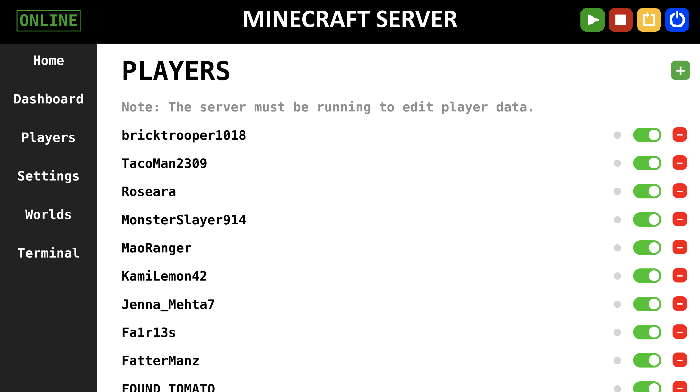

# ServerUI

Minecraft server web interface for players to control server settings remotely.

## Homepage

Firestorm loads the home tab as default when a user connects to the webpage. It plays a slideshow of pictures from different worlds played on the server.

## Dashboard

The dashboard presents basic system stats such as CPU and RAM usage, as well as server stats such as the number of players online and the current loaded world. It also features a slider which controls how much RAM is allocated towards running the Minecraft server process.

## Players Tab

The players tab presents a list of all currently whitelisted players. Players can also be added, removed, and given "oped", or moderator status on the Minecraft Server. Each player also has their own status light which turns green when they are online.

## Settings Tab

The settings tab allows the Minecraft server's settings to be modified and saved from the webpage.

## Worlds Tab

The worlds tab displays a list of all the worlds currently stored in the server's files. From this list, players can click specific worlds to load them onto the server. Worlds can also be uploaded in the form of ZIP files, and can also be removed and sent to the archive. This tab also has a backup feature which backs up all available world data to the computer's SSD drive and to an external SD card. This feature also disables the webpage to prevent players from modifying the server files during a backup.

## Terminal Tab

The terminal tab allows for commands to be piped straight into the Minecraft Server process. 

